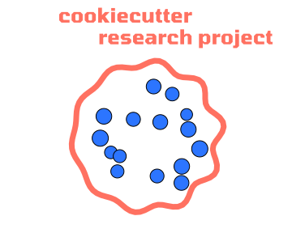

# Cookiecutter Research Project

A template for a modern, fully featured and efficient research project.



## Setup

Prerequisites:

- the Python [package manager uv](https://docs.astral.sh/uv/)
- `cookiecutter` package (link [here](https://github.com/cookiecutter/cookiecutter))
- an installation of [Quarto](https://quarto.org/)
- an installation of [LaTeX](https://www.latex-project.org/)

## How to use this template

To install cookiecutter, which will help you populate the template with details like your project's name, run

```bash
uv tool install cookiecutter
```

To create a new project folder based on this cookie cutter:

```bash
uv tool run cookiecutter https://github.com/aeturrell/cookie-cutter-research-project.git
```

The new project folder will appear within the folder you ran the command in.

## Working on your project

This assumes you are in the project root.

First, run `uv sync` to create the Python environment (it installs into `.venv`)

To create the paper, use `make paper`.

To create the slides, use `make slides`.

## You might also like

Looking for further reproducible research inspiration? Check out this [worked example](https://github.com/aeturrell/example-reproducible-research) of a reproducible research project.
