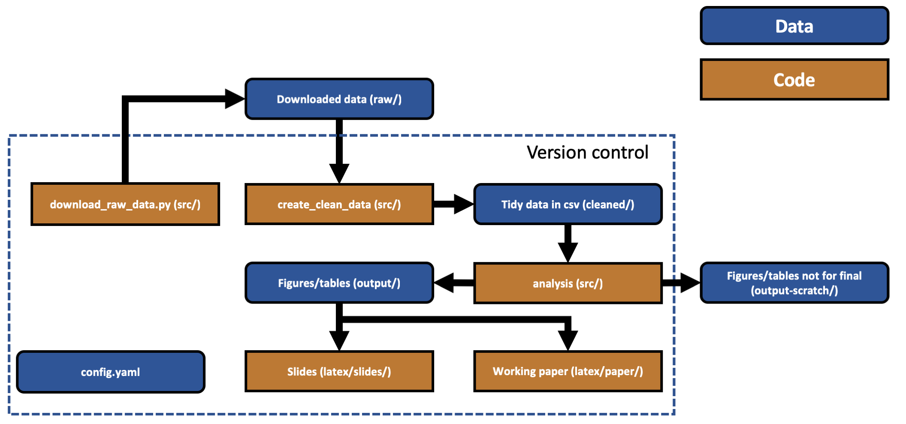

# Cookiecutter research project

This is an example, or 'cookiecutter', repository for a research project. ```git clone``` the project and use it as a skeleton for your own research project. A full explanation may be found in [this accompanying blog post](http://aeturrell.com//2019/06/26/get-organised/). The idea is that this project structure should be as simple as possible, but no simpler.


While the example happens to be in Python, the structure of the project should be applicable to any language. The structure is sketched out below:


#### Example project details

The code is in Python 3 and uses the ONS API to download some macroeconomic time series, process them into tidy data, and then use them within a dynamic factor model&dagger; inspired by [Chad Fulton](http://www.chadfulton.com/)'s tutorials/notebooks which you can find [here](http://www.chadfulton.com/fulton_statsmodels_2017/sections/6-out-of-the-box_models.html#dynamic-factors) and [here](https://www.statsmodels.org/dev/examples/notebooks/generated/statespace_dfm_coincident.html).

The project here is very much a toy example and not intended to be accurate or say anything at all about the real world!

Note that paths, the series to download, and visualisation settings are all defined in config.yaml. The data processing steps are separated: raw data to file first, then cleaned data into tidy format in a csv, and finally the time series are used in a statistical model. The plots are similarly just examples.

Within the example project, there are latex templates for both slides and a working paper. These are based on [Paul Goldsmith-Pinkham](https://twitter.com/paulgp?lang=en)'s excellent templates, the originals of which you can find [here for slides](https://github.com/paulgp/beamer-tips) and [here for the working paper](https://github.com/paulgp/draft-tex).

More on the example dynamic factor model found in ```analysis.py``` in the blog post.

where capital Greek and Latin characters represent matrices, arrows over characters denote vectors, and it is assumed that the different components of the `innovations' in the error updating equation are uncorrelated so that $ \Sigma $ is a diagonal matrix. The model has one unobserved factor that follows an AR(2), and the errors similarly follow an AR(2).

#### Re-running the example project

To re-run the analysis part of the project with conda, first install the required packages in a new conda environment:
```
conda env create -f ccenv.yml
```
You then need to activate the environment to use in your IDE. The command for this is ```conda activate ccenv```. Note that, to try to ensure compatibility with all operating systems, the environment file is simplified. It only specifies the version of Python, conda is trusted to resolve dependencies and pick the right versions of other required packages.

Then run the files in this order to create the final PDF outputs:
- download_raw_data.py
- create_clean_data.py
- analysis.py
- both Latex files*


&ast; You may find that because the .eps files used for figures are not in a sub-directory of the main .tex folder, you must add a flag to the Latex compiler. In TexShop, the steps are:
- Go to Preferences
- Go to Tab "Engine"
- Go to the field "pdfTeX"
- In the LaTeX Input Field add ``` --shell-escape``` at the end so that it changes from ```pdflatex --file-line-error --synctex=1```
to ```pdflatex --file-line-error --synctex=1 --shell-escape```